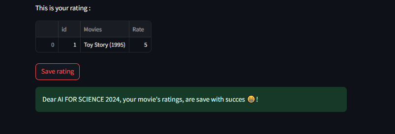
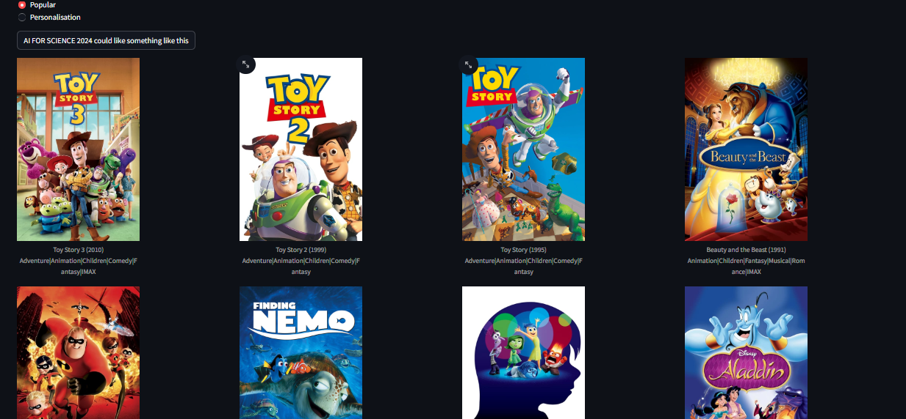

# apply_ML_AS
A Recommender System

# Purpose 
The goal of this project is to implement various version of ALS(Alternative Least Square) for matrix factorization
- ALS with bias only
This method optimizes user and item biases to produce robust predictions and is very useful for capturing global trends. However, it's limited in its ability to model complex interactions between users and items.

- ALS with bias and latent vecteur
Now, we will enhance our model by incorporating latent vectors, allowing us to capture more complex relationships between users and items.

- ALS with adding feature
 To mitigate the cold start problem, we will consider that each item has associated features, and the model will incorporate these features in the recommendation process.

# Photos

  
  

 
# Demo

# Social

