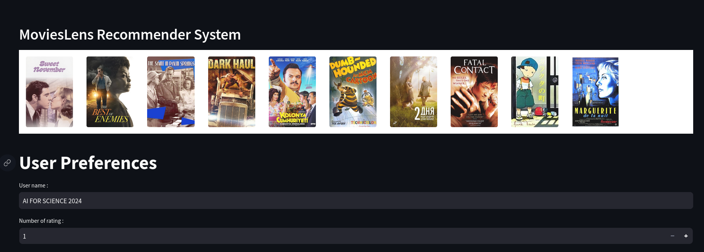

# apply_ML_AS
A Recommender System

# Project Purpose
The objective of this project is to implement various versions of the Alternating Least Squares (ALS) algorithm for matrix factorization. The three approaches we will explore are:

## 1. ALS with Bias Only

This method optimizes user and item biases to produce robust predictions. It is highly effective for capturing global trends, such as average user ratings and item popularity. However, its simplicity limits its ability to model complex interactions between users and items.

  
  

## 2. ALS with Bias and Latent Vectors

To enhance our model, we will incorporate latent vectors. This allows us to capture more complex relationships between users and items, leading to more personalized and accurate recommendations. By combining biases with latent factors, the model can better understand the unique preferences of users and the specific characteristics of items.

  
  

## 3. ALS with Added Features

To address the cold start problem, where new items or users lack sufficient data for accurate recommendations, we will include item-associated features in our model. By incorporating these features, the model can provide better recommendations even when limited user-item interaction data is available. This approach helps improve the recommendation quality, especially for new or less popular items.

## Visualizing Our Embeddings

Finally, we will visualize our embeddings to better understand the learned representations of users and items. 

  

# Photos

  
  

 
# Demo

  
  

# Social

